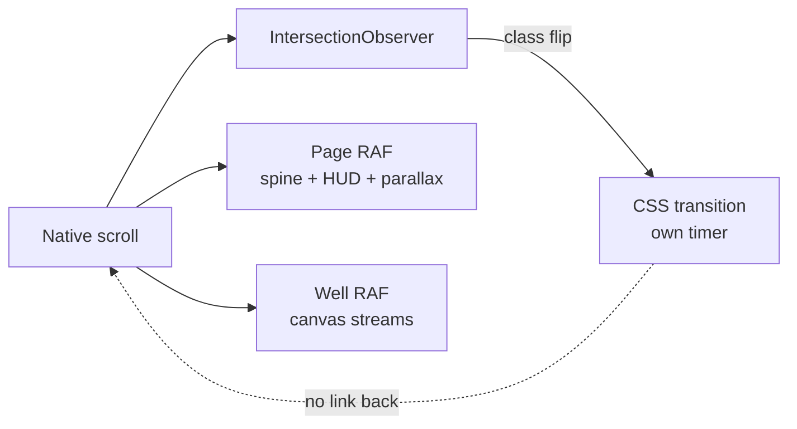
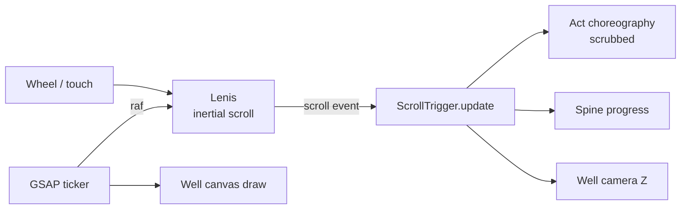

# feat: Scroll-linked motion architecture for the JS the WLD homepage

## Summary

The homepage's motion currently uses **fire-once** reveals: an IntersectionObserver flips a class when an element crosses a threshold, and a CSS transition then plays on its own clock, independent of scroll. This is why the page does not feel like the references (Kalsø, 247artists) — those use **scroll-linked** motion, where an element's position is a continuous function of scroll offset. Content moves with the reader's finger, reverses on scroll-up, and never "pops."

This plan replaces the reveal architecture with GSAP ScrollTrigger for scroll-linked tweening and Lenis for inertial smooth scroll, and reworks the hero strand interaction from a global field translation into a local, constellation-style reach.

---

## Problem Frame

Three distinct problems, one of which is architectural:

1. **Motion is fire-once, not scroll-linked (architectural).** Every reveal on the page — `.grow`, `.slide`, `.tell`, `.shout`, `.act__word` — is an IntersectionObserver class flip plus a CSS transition. Once triggered, the animation runs on a timer and ignores the scroll wheel. Scrolling back up does not reverse it. Nothing is *driven* by scroll position.
2. **Hero strand hover behaves as a global translation.** `src/components/Well.astro` adds `pxr * lean * 210` to *every* sampled point of *every* stream, so the whole field slides toward the cursor. The requested behavior is local: strands near the pointer reach toward it, distant strands stay put — the behavior of the constellation in the Billy Bob lightform.
3. **Choreography is uniform.** Sections differ in entry direction but share one timing curve and one trigger model, so the page reads as a sequence of similar events rather than composed motion.

**Already fixed, not part of this plan:** the Words portrait rendered at natural size because moving it from `.grow` to `.slide` dropped it out of the `.grow img` sizing rule. Fixed and shipped (`.grow img, .stage > .slide img`). U5 below adds a guard so this class of regression cannot recur silently.

### Non-goals

- No content, copy, or information-architecture changes.
- No redesign of palette, type, or section order.
- No migration of `/about`, `/book`, `/field` (still on the retired serif system — tracked separately in DESIGN.md's Migration status).

---

## Requirements

| ID | Requirement |
|----|-------------|
| R1 | Hero strands reach toward the pointer **locally**, with influence falling off by distance; strands far from the pointer are visibly unaffected |
| R2 | Section motion is driven continuously by scroll position, and reverses when scrolling up |
| R3 | Page scroll carries inertia comparable to the reference sites |
| R4 | Each act has its own choreography rather than one shared reveal |
| R5 | `prefers-reduced-motion` yields a static, fully legible page with no smooth-scroll hijack |
| R6 | No horizontal overflow; no image renders unconstrained at any breakpoint |
| R7 | Anchor navigation (the spine's station links) continues to work under smooth scroll |

---

## Key Technical Decisions

### KTD1 — GSAP ScrollTrigger + Lenis, not Scrollama

**Decision:** Add `gsap` (3.15.0) and `lenis` (1.3.25).

**Rationale:** The user named pudding.cool's library (Scrollama). Scrollama is a *step-detection* library built on IntersectionObserver — it answers "has this step entered view," which the codebase already does for 0KB. It does not produce scroll-linked tweening or smooth scroll, so it cannot close the gap identified in the Problem Frame. 247artists.com — the motion reference — loads GSAP and Luge (verified from its script tags: `npm-gsap.js`, `npm-luge.js`). ScrollTrigger is chosen over Luge for documentation depth and community size; Lenis supplies the inertia that Luge would otherwise bundle.

**Licensing (verified):** GSAP is free for commercial use as of 2025 including all formerly-paid plugins, with no registration required; the only restriction concerns building competing no-code animation tools. Lenis is MIT.

**Cost:** ~25–30KB gzipped on a site that currently ships almost no JS. Accepted deliberately — the motion *is* the product on this surface.

### KTD2 — Local radial falloff replaces global translation

**Decision:** Pointer influence becomes a per-point function of distance from the cursor in screen space, not a constant offset applied to the whole field.

**Rationale:** Directly implements R1. Shape: for each sampled point, compute screen distance `d` to the pointer, derive `infl = max(0, 1 - d / RADIUS)` with an ease (e.g. `infl²` or smoothstep), then displace along the point→cursor vector by `infl * REACH`. Distant points get `infl = 0` and do not move at all.

**Directional sketch — not implementation specification:**

```
for each sampled point p:
    d     = distance(p.screen, pointer)
    infl  = smoothstep(RADIUS, 0, d)        # 1 at cursor, 0 at RADIUS
    infl *= depthWeight(p.z)                # nearer strands respond more
    p.screen += normalize(pointer - p.screen) * infl * REACH
```

`RADIUS` and `REACH` are the two tuning knobs; expect to tune them live rather than pick them in the plan.

### KTD3 — Lenis drives GSAP's ticker

**Decision:** Drive `ScrollTrigger.update` from Lenis's scroll event and run Lenis's RAF from GSAP's ticker, with GSAP's lag smoothing disabled.

**Rationale:** Two independent RAF loops fighting over scroll position is the standard failure mode of this pairing and produces visible jitter. One loop, one clock.

### KTD4 — Reduced motion disables Lenis entirely

**Decision:** Under `prefers-reduced-motion: reduce`, Lenis is never instantiated and ScrollTrigger tweens are registered with their end-state applied immediately.

**Rationale:** Smooth scroll is itself a vestibular trigger; scoping the check to individual tweens while leaving scroll hijacked would miss the main offender. Also preserves native scrolling for assistive tech.

---

## High-Level Technical Design

Current architecture (fire-once, three independent clocks):



Target architecture (one clock, scroll as the driver):



The essential change: scroll position becomes an *input* that tweens read continuously, rather than a trigger that fires and forgets.

---

## Implementation Units

### U1. Motion foundation: dependencies, Lenis, and the single ticker

**Goal:** Install the libraries and establish one scroll clock the rest of the plan builds on.

**Requirements:** R3, R5, R7

**Dependencies:** none

**Files:**
- `package.json` (add `gsap`, `lenis`)
- `src/components/Motion.astro` (new — owns Lenis init, GSAP registration, ticker wiring)
- `src/layouts/Base.astro` (mount `Motion` when the page opts in)

**Approach:** A single component owns the lifecycle so no page can instantiate two Lenis instances. Register `ScrollTrigger`, disable `gsap.ticker.lagSmoothing`, drive `lenis.raf` from the ticker, and call `ScrollTrigger.update` on Lenis's scroll event. Gate the entire block behind a reduced-motion check (KTD4). Keep the existing hero failsafe intact — nothing in this unit may reintroduce a state where content can stay invisible.

**Patterns to follow:** the existing reduced-motion guard shape in `src/components/Well.astro`; the hidden-tab failsafe in `src/pages/index.astro`.

**Test scenarios:**
- With reduced motion off, scrolling produces easing/inertia distinct from native scroll
- With reduced motion on, `Lenis` is never constructed and `document.documentElement` carries no smooth-scroll transform
- Clicking a spine station link scrolls to the correct section under smooth scroll (R7) and lands within a few px of the section top
- Only one RAF loop advances Lenis (assert a single instance is exposed)
- Navigating away and back does not accumulate a second instance

**Verification:** Scroll feels inertial; anchor links land correctly; reduced-motion users get native scrolling.

---

### U2. Convert act reveals to scroll-linked tweens

**Goal:** Replace the fire-once IntersectionObserver reveals with ScrollTrigger tweens whose progress is bound to scroll position.

**Requirements:** R2, R4, R5

**Dependencies:** U1

**Files:**
- `src/pages/index.astro` (replace the `risers` IntersectionObserver block; retire `.in` class transitions in favor of scrubbed tweens)

**Approach:** Each act becomes a ScrollTrigger with `scrub` so its motion tracks scroll both directions. Figures (`.grow`, `.slide`) and copy (`.tell`) become timeline children with per-act offsets so acts differ from one another (R4). The existing CSS transition rules for these classes are removed rather than left dormant — two systems animating the same properties is the likeliest source of the "pop" artifact.

**Execution note:** Convert one act end-to-end and confirm the feel before porting the rest; a wholesale conversion makes a bad curve hard to isolate.

**Test scenarios:**
- Scrolling an act halfway in and stopping leaves its elements visibly mid-animation (proves scrub, not fire-once)
- Scrolling back up reverses the motion rather than leaving it complete
- With reduced motion on, all act content is at its end state and no tween is registered
- No element remains at `opacity: 0` after the act has fully passed the viewport
- Fast-scrolling from top to bottom leaves every act in its end state (no stuck partial)

**Verification:** Motion tracks the wheel continuously and reverses; nothing pops.

---

### U3. Constellation-style local reach on the hero strands

**Goal:** Strands near the pointer reach toward it; distant strands do not move.

**Requirements:** R1, R5

**Dependencies:** none (independent of U1/U2 — can land first)

**Files:**
- `src/components/Well.astro`

**Approach:** Per KTD2, replace the global `pxr/pyr * lean * 210` offset with a per-point radial falloff. The travelling highlight on each stream must use the same displacement function or it will detach from its strand (this already regressed once and was fixed). Keep the existing eased pointer state so the response stays fluid. Retain touch support.

**Test scenarios:**
- Pointer at one edge: strands near that edge displace, strands at the opposite edge are within a pixel of their unhovered position
- Pointer removed: strands ease back to rest, not snap
- The travelling highlight stays on its strand at all pointer positions
- With reduced motion on, the canvas draws one static frame and no pointer listener displaces anything
- Touch drag produces the same local reach as pointer hover (this was missing entirely before and is easy to drop again)

**Verification:** Hovering reads as the field responding *near the cursor*, matching the lightform constellation.

---

### U4. Per-act choreography

**Goal:** Give each act its own motion signature instead of one shared curve.

**Requirements:** R4

**Dependencies:** U2

**Files:**
- `src/pages/index.astro`

**Approach:** With scrubbing in place, differentiate: Words builds laterally, Code arrives on Z, Music's strip staggers across the row, the close settles. Consider pinning one act so its content advances while the section holds — the dominant device on both reference sites — but pin at most one; pinning several is the main cause of a page feeling like it fights the reader.

**Test scenarios:**
- Each act's elements follow visibly different paths (assert differing transform properties at equal scroll progress)
- If an act is pinned, the pinned section releases correctly and total page height accounts for the pin distance
- No act's motion overlaps another's such that two sections animate simultaneously mid-viewport
- Reduced motion: all acts static, no pin applied

**Verification:** Scrolling the page reads as composed sequence, not repetition.

---

### U5. Image sizing invariant

**Goal:** Make the giant-image regression class structurally impossible.

**Requirements:** R6

**Dependencies:** none

**Files:**
- `src/pages/index.astro`
- `src/components/Well.astro` (no change expected; listed only if canvas sizing is touched)

**Approach:** The regression happened because image sizing was keyed to an *animation* class (`.grow`) rather than to *being a figure image in a stage*. Sizing should key on structural position, with animation classes carrying only motion. Audit every figure to confirm none depends on an animation class for its dimensions.

**Test scenarios:**
- Every `figure img` on the page has a computed width ≤ its container and a constrained aspect ratio
- `document.documentElement.scrollWidth === window.innerWidth` at 375px, 768px, 1440px
- Swapping an animation class on any figure (e.g. `.grow` → `.slide`) leaves its rendered dimensions unchanged
- The lightform and Storm Door banner keep their natural aspect ratio (they are deliberate exceptions)

**Verification:** No image renders unconstrained; the class swap that caused the regression is provably inert.

---

### U6. Performance, mobile, and accessibility pass

**Goal:** Confirm the added motion does not cost frame rate or exclude anyone.

**Requirements:** R3, R5, R6

**Dependencies:** U1–U4

**Files:**
- `src/components/Well.astro`, `src/components/Motion.astro`, `src/pages/index.astro`

**Approach:** Four canvas instances plus scrubbed tweens plus smooth scroll is real load. Confirm the off-screen canvas pause still fires under Lenis (Lenis changes how scroll events arrive, and the existing IntersectionObserver pause may need rechecking). Verify on a mid-tier device, not just desktop.

**Test scenarios:**
- Sustained ~60fps scrolling the full page on desktop with CPU throttled 4×
- Off-screen wells stop drawing (assert RAF is cancelled when a canvas leaves the viewport)
- On a real phone, touch scroll retains momentum and the strands respond to drag
- Full keyboard traversal reaches every link with visible focus; smooth scroll does not trap focus
- With reduced motion on: no Lenis, no scrub, no parallax, no canvas animation — page fully legible

**Verification:** No dropped frames on a mid-tier phone; reduced-motion path is genuinely static.

---

## Risks & Dependencies

| Risk | Mitigation |
|------|-----------|
| Smooth scroll fights the browser's native anchor jumps and the spine links break | U1 test scenario covers it; Lenis exposes `scrollTo` for anchors — route the spine through it |
| Two animation systems (leftover CSS transitions + GSAP) animate the same property and produce jitter | U2 removes the CSS rules rather than leaving them dormant |
| Pinning multiple sections makes the page feel like it's fighting the reader | U4 constrains to at most one pinned act |
| Bundle cost on a site that currently ships almost no JS | Accepted per KTD1; load the motion bundle only on the homepage, not sitewide |
| Smooth scroll is a known vestibular trigger | KTD4 disables Lenis entirely under reduced motion |
| Mobile Safari momentum conflicts with Lenis | U6 requires testing on a real device; the harness cannot verify this |

---

## Open Questions

- **Pin or no pin?** Pinning one act is the strongest device on both reference sites but is also the most intrusive. Recommend trying it on Code (the shortest act, lowest risk) and judging visually. Deferred to implementation — it is a feel decision, not a planning one.
- **`RADIUS` / `REACH` values for U3** are tuning constants; deferred to live iteration.
- **Does the homepage-only bundle split matter?** If the inner pages later adopt the same motion, `Motion.astro` moves to the layout. Not worth solving now.

---

## Verification I Cannot Perform

Stated plainly because it has bitten this project repeatedly: the browser automation available to me runs in a **hidden tab where `requestAnimationFrame` is frozen**. Canvas animation, hover reactivity, scrub feel, and smooth-scroll inertia therefore **cannot be verified by me** — I can assert DOM state and computed styles, but not motion. Every "feel" item in this plan requires the user's eyes on a real screen, and any claim I make about how it feels is inference, not observation.

---

## Sources & Research

- 247artists.com script tags — confirms GSAP (`npm-gsap.js`) and Luge (`npm-luge.js`) as the reference site's motion stack
- GSAP standard license — free for commercial use including all plugins, no registration; restriction limited to competing no-code animation builders
- `npm view`: `gsap@3.15.0`, `lenis@1.3.25` (MIT)
- Scrollama (pudding.cool) evaluated and rejected — step-detection only, does not provide scroll-linked tweening (KTD1)
- `src/components/Well.astro`, `src/pages/index.astro` — current fire-once reveal implementation and the global-translation hover
